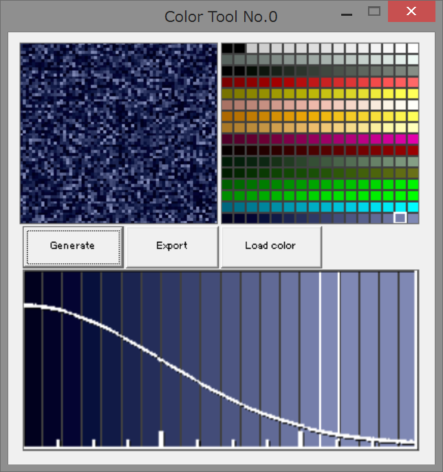

Color Tool No.1
====
正規分布でドットを配置するツール

特徴
----

 * 正規分布に従いドットを配置した画像を出力する
 * GUIによる直観的な操作が可能
 * 24色Bitmap形式で出力が可能

操作方法
----
 

概要
------
上左半分の領域を「プレビュー」、上右半分の領域を「パレット」、下の表示を「色分布」と呼ぶ 
本アプリケーションの操作は「色分布」、「パレット」のクリックと3つのボタンで行う

パレット
------
パレットは16 x 16 = 256色の色を設定できる 
「Load color」ボタンを押すとパレット色情報ファイルを選択するダイアログが出現する 
色はパレット上左クリックで選択する 
パレット色情報ファイルはRGBの値をカンマ区切りで並べたテキストファイルである 
[パレット色情報ファイルの例](./sample/color.txt) 

色分布
------
色分布中のグラフは平均0、分散1の正規分布のグラフである(横軸目盛り間隔:1) 
色分布では、0から11の範囲を20個の領域に分割している 
分割された領域はクリックで選択でき、その状態でパレットの色を左クリックすると、その領域が選択色に設定される 
なお、色分布中で色を右クリックするとすべての領域を選択色で塗りつぶすことができる 

プレビュー
------
「Generate」ボタンを押すと「プレビュー」に、色分布で示された分布で画像が作成される 

ファイル出力
------
「Export」ボタンを押すと、「プレビュー」に示された画像を保存することができる 
対応画像形式: 
 * 24色ビットマップ

ライセンス
----
MITライセンスで公開する 
[LICENSE.md](LICENSE.md)を参照 
